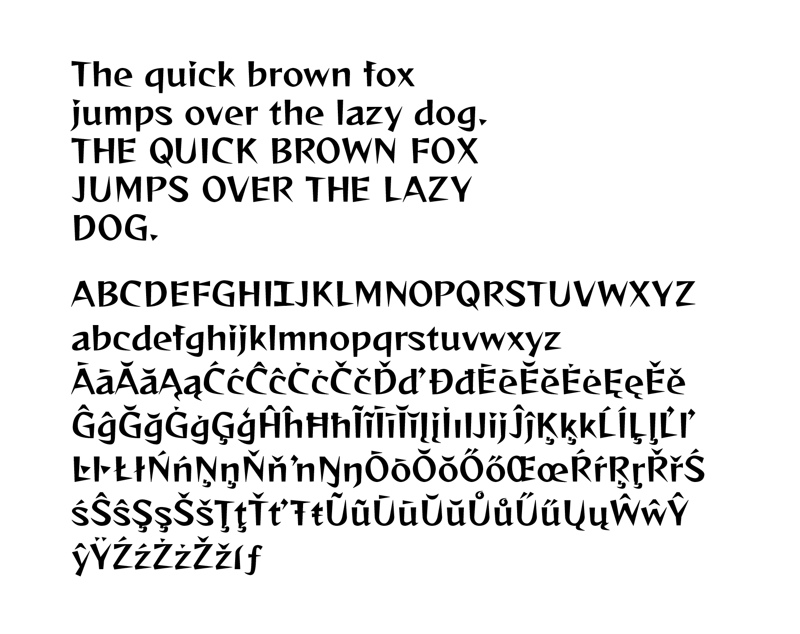

# Reggae Remixed

This is a version of [Fontwork's Reggae](https://github.com/fontworks-fonts/Reggae) typeface that adapts it for use in English-language comics. 

**This font includes 119 additional characters** (like Ō and Å) that were composed with the original accent glyphs from Reggae One. This font also uses OpenType contextual alternates to replace a crossbar I glyph for personal I's per comic lettering conventions. 

All modifications are made in accordance to the [SIL Open Font License](https://scripts.sil.org/cms/scripts/page.php?site_id=nrsi&id=OFL) on Reggae. 

### Download the font

[Latest release](./fonts/otf/ReggaeRemixed.otf)

### Font source files

The raw glyphs are available [here](./sources/ReggaeRemixed.glyphs).

The FontLab file is available [here](./sources/ReggaeRemixed.vfc). It was created in FontLab 7.

### Licence

This font is licensed under the [SIL Open Font License](https://scripts.sil.org/cms/scripts/page.php?site_id=nrsi&id=OFL).

### Prohibited acts

* Redistribute under license except 'SIL Open Font License Version 1.1'.
* Selling ​​the font file itself.

### About Me

I'm a manga letterer who uses fonts like these every day. I have more fonts for manga lettering available on my [Gumroad](https://gumroad.com/salinsley), and I talk about manga, type, and lettering on my [Twitter @salinsley](https://twitter.com/salinsley).
